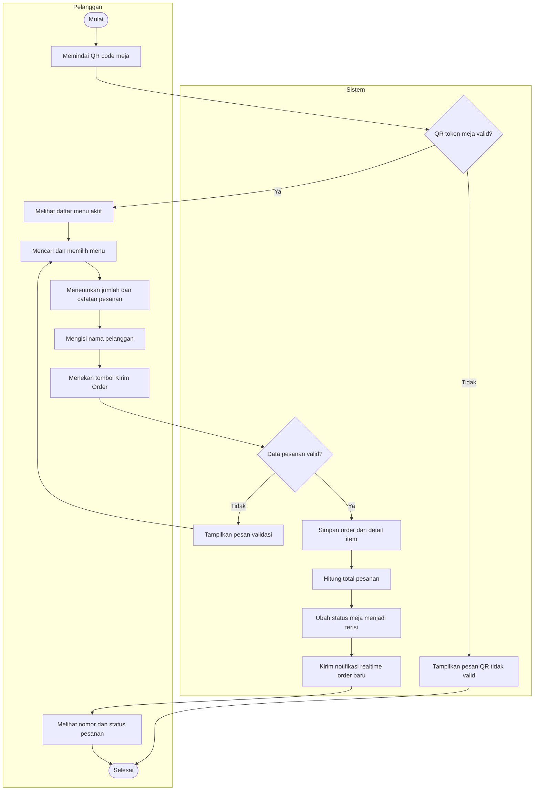
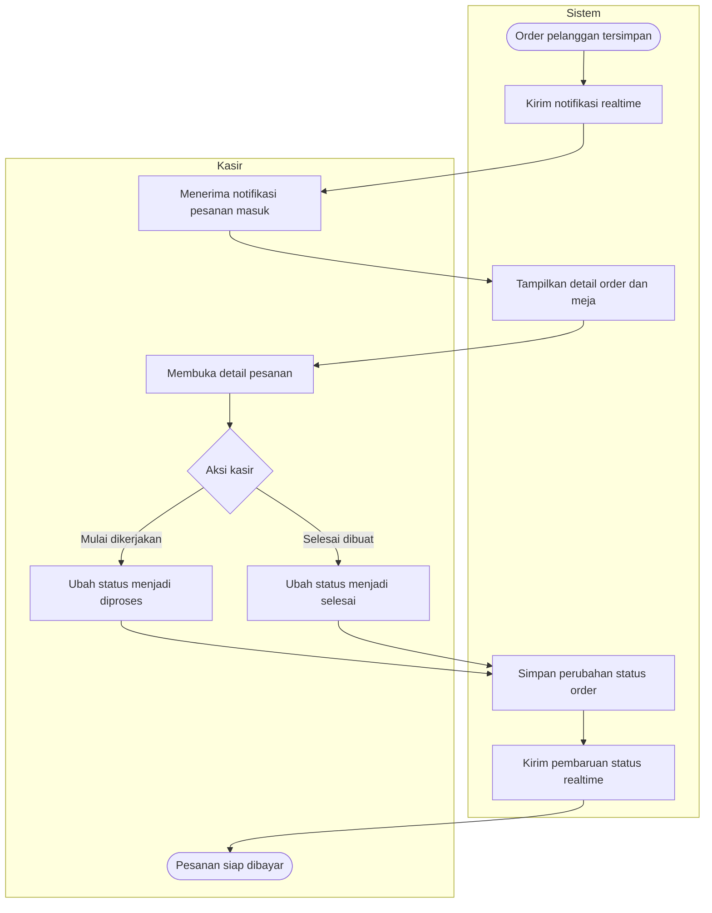
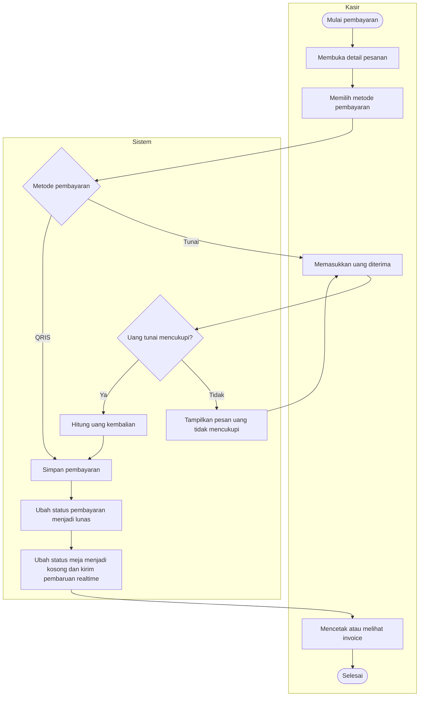
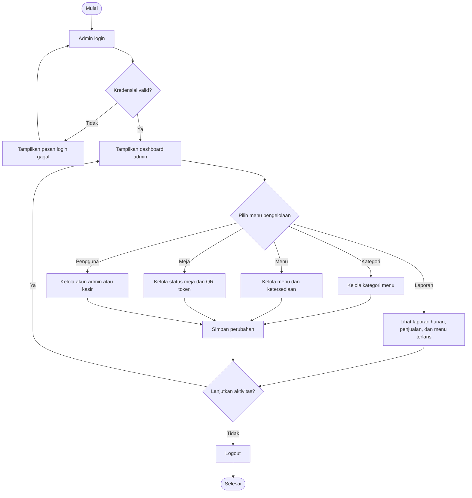
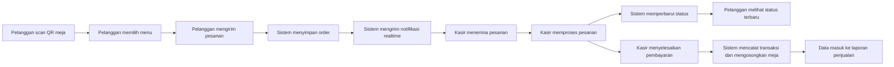
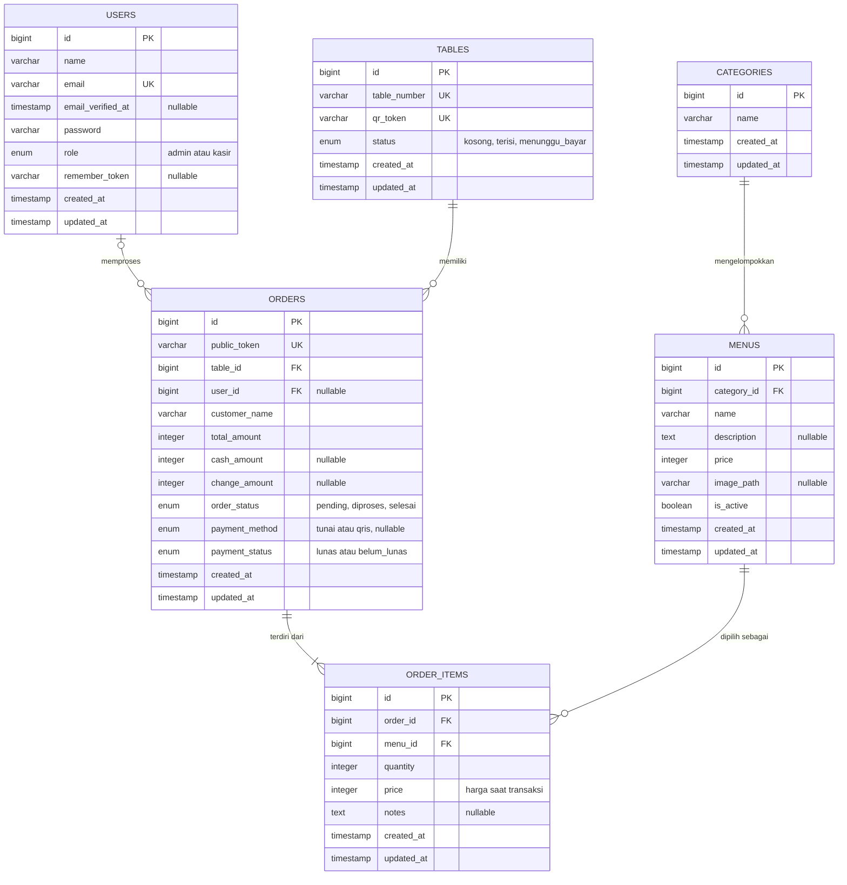

# Perancangan Sistem POS Bakso Nusantara

## 1. Ruang Lingkup

Dokumen ini menjelaskan rancangan proses dan basis data untuk aplikasi POS Bakso Nusantara. Sistem mendukung:

- Pemesanan mandiri pelanggan melalui QR code pada meja.
- Pemantauan pesanan masuk secara realtime oleh kasir.
- Pemrosesan pesanan dan pembayaran tunai atau QRIS.
- Pengelolaan kategori, menu, meja, pengguna, dan laporan oleh admin.

## 2. Aktor Sistem

| Aktor | Tanggung Jawab |
| --- | --- |
| Pelanggan | Memindai QR meja, memilih menu, mengirim pesanan, dan memantau status pesanan. |
| Kasir | Menerima notifikasi pesanan, memproses pesanan, menerima pembayaran, dan mencetak invoice. |
| Admin | Mengelola master data, akun pengguna, status meja, serta melihat laporan penjualan. |
| Sistem | Memvalidasi data, menyimpan transaksi, menghitung total, dan mengirim pembaruan realtime. |

## 3. Activity Diagram

### 3.1 Pemesanan Pelanggan dari QR Meja

### 3.2 Pemrosesan Pesanan oleh Kasir

### 3.3 Pembayaran Pesanan

### 3.4 Pengelolaan Data oleh Admin

### 3.5 Alur Utama Terintegrasi

## 4. Perancangan Basis Data

### 4.1 ERD Utama

### 4.2 Penjelasan Relasi

| Relasi | Kardinalitas | Penjelasan |
| --- | --- | --- |
| `categories` ke `menus` | Satu ke banyak | Satu kategori dapat berisi banyak menu. Setiap menu wajib berada dalam satu kategori. |
| `tables` ke `orders` | Satu ke banyak | Satu meja dapat memiliki banyak riwayat order. Setiap order berasal dari tepat satu meja. |
| `users` ke `orders` | Nol atau satu ke banyak | Satu kasir dapat memproses banyak order. Order dari QR pelanggan dapat dibuat sebelum memiliki kasir sehingga `user_id` bersifat opsional. |
| `orders` ke `order_items` | Satu ke banyak | Satu order wajib memiliki minimal satu detail item. |
| `menus` ke `order_items` | Satu ke banyak | Satu menu dapat muncul pada banyak detail transaksi. |

### 4.3 Kamus Data

#### Tabel `users`

| Kolom | Tipe | Aturan | Keterangan |
| --- | --- | --- | --- |
| `id` | `bigint` | Primary key | Identitas pengguna. |
| `name` | `varchar` | Wajib | Nama admin atau kasir. |
| `email` | `varchar` | Wajib, unik | Email untuk login. |
| `password` | `varchar` | Wajib | Password yang telah di-hash. |
| `role` | `enum` | `admin`, `kasir` | Hak akses pengguna. |

#### Tabel `categories`

| Kolom | Tipe | Aturan | Keterangan |
| --- | --- | --- | --- |
| `id` | `bigint` | Primary key | Identitas kategori. |
| `name` | `varchar` | Wajib | Nama kategori, misalnya bakso atau minuman. |

#### Tabel `tables`

| Kolom | Tipe | Aturan | Keterangan |
| --- | --- | --- | --- |
| `id` | `bigint` | Primary key | Identitas meja. |
| `table_number` | `varchar` | Wajib, unik | Nomor atau kode meja. |
| `qr_token` | `varchar` | Wajib, unik | Token QR untuk membuka menu pelanggan. |
| `status` | `enum` | `kosong`, `terisi`, `menunggu_bayar` | Kondisi meja saat ini. |

#### Tabel `menus`

| Kolom | Tipe | Aturan | Keterangan |
| --- | --- | --- | --- |
| `id` | `bigint` | Primary key | Identitas menu. |
| `category_id` | `bigint` | Foreign key | Kategori menu. |
| `name` | `varchar` | Wajib | Nama menu. |
| `description` | `text` | Opsional | Deskripsi menu. |
| `price` | `integer` | Wajib | Harga menu dalam rupiah. |
| `image_path` | `varchar` | Opsional | Lokasi gambar menu. |
| `is_active` | `boolean` | Default `true` | Menentukan apakah menu dapat dipesan. |

#### Tabel `orders`

| Kolom | Tipe | Aturan | Keterangan |
| --- | --- | --- | --- |
| `id` | `bigint` | Primary key | Identitas transaksi internal. |
| `public_token` | `varchar(64)` | Wajib, unik | Token publik untuk memantau pesanan pelanggan tanpa login. |
| `table_id` | `bigint` | Foreign key | Meja asal pesanan. |
| `user_id` | `bigint` | Foreign key, opsional | Kasir yang menangani transaksi. |
| `customer_name` | `varchar` | Wajib | Nama pelanggan pemesan. |
| `total_amount` | `integer` | Default `0` | Total nilai pesanan dalam rupiah. |
| `cash_amount` | `integer` | Opsional | Uang tunai yang diterima. |
| `change_amount` | `integer` | Opsional | Uang kembalian pelanggan. |
| `order_status` | `enum` | `pending`, `diproses`, `selesai` | Tahap pengerjaan pesanan. |
| `payment_method` | `enum` | `tunai`, `qris`, opsional | Metode pembayaran yang dipilih. |
| `payment_status` | `enum` | `lunas`, `belum_lunas` | Status pelunasan transaksi. |

#### Tabel `order_items`

| Kolom | Tipe | Aturan | Keterangan |
| --- | --- | --- | --- |
| `id` | `bigint` | Primary key | Identitas detail pesanan. |
| `order_id` | `bigint` | Foreign key | Transaksi induk. |
| `menu_id` | `bigint` | Foreign key | Menu yang dipesan. |
| `quantity` | `integer` | Wajib | Jumlah menu yang dipesan. |
| `price` | `integer` | Wajib | Salinan harga menu saat transaksi dibuat. |
| `notes` | `text` | Opsional | Catatan khusus pelanggan. |

Semua tabel utama memiliki `created_at` dan `updated_at` untuk mencatat waktu pembuatan serta perubahan data.

### 4.4 Tabel Pendukung Teknis

Selain tabel bisnis utama, aplikasi menggunakan tabel bawaan Laravel:

| Tabel | Fungsi |
| --- | --- |
| `personal_access_tokens` | Menyimpan token autentikasi API Laravel Sanctum. |
| `password_reset_tokens` | Mendukung pemulihan password pengguna. |
| `sessions` | Menyimpan sesi aplikasi jika session driver menggunakan database. |
| `cache`, `cache_locks` | Menyimpan cache dan lock aplikasi. |
| `jobs`, `job_batches`, `failed_jobs` | Mendukung pemrosesan antrean pekerjaan Laravel. |

### 4.5 Aturan Bisnis Penting

1. Pelanggan hanya dapat membuka menu melalui `qr_token` meja yang valid.
2. Pelanggan hanya dapat memesan menu dengan `is_active = true`.
3. Setiap order memiliki minimal satu `order_item`.
4. Nilai `order_items.price` menyimpan harga saat transaksi agar histori tetap benar walaupun harga menu berubah.
5. `orders.total_amount` dihitung dari jumlah `quantity * price` seluruh detail pesanan.
6. Pembayaran tunai hanya dapat diselesaikan jika uang diterima mencukupi total transaksi.
7. Setelah pembayaran selesai, `payment_status` menjadi `lunas` dan meja dapat digunakan kembali.
8. Perubahan order dikirim secara realtime agar pelanggan, kasir, dan admin memperoleh status terbaru tanpa refresh manual.

### 4.6 Normalisasi Basis Data

Struktur basis data telah menerapkan prinsip normalisasi hingga Third Normal Form (3NF):

1. Setiap tabel memiliki primary key dan menyimpan data atomik.
2. Data kategori, menu, meja, transaksi, dan detail transaksi dipisahkan sesuai tanggung jawabnya.
3. Informasi yang berulang dihubungkan dengan foreign key.
4. Harga pada `order_items` sengaja disimpan sebagai snapshot transaksi, bukan duplikasi yang perlu mengikuti perubahan harga menu.

